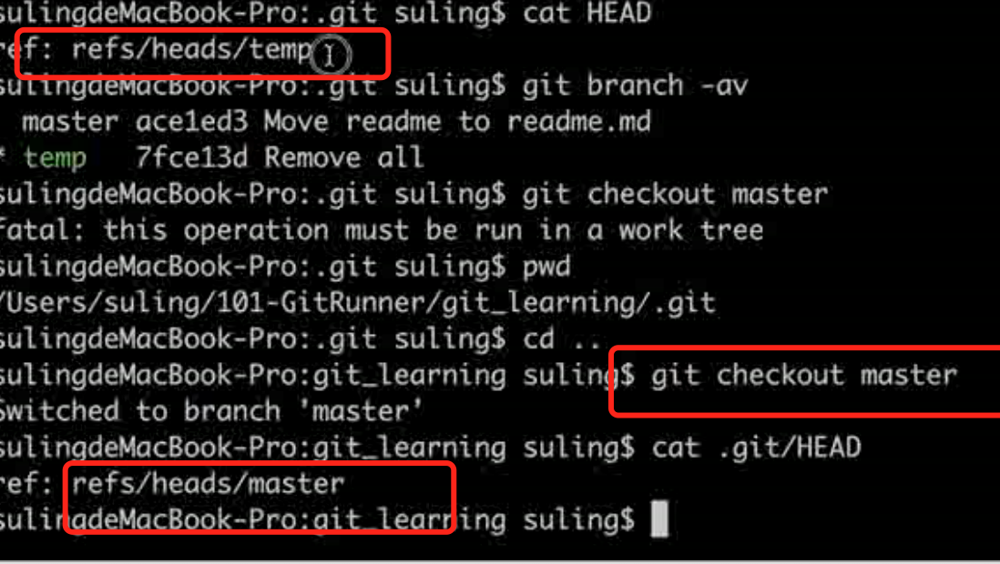
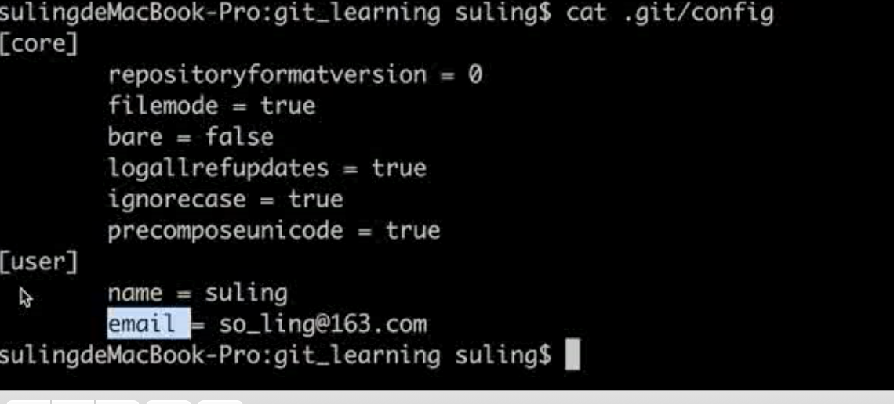
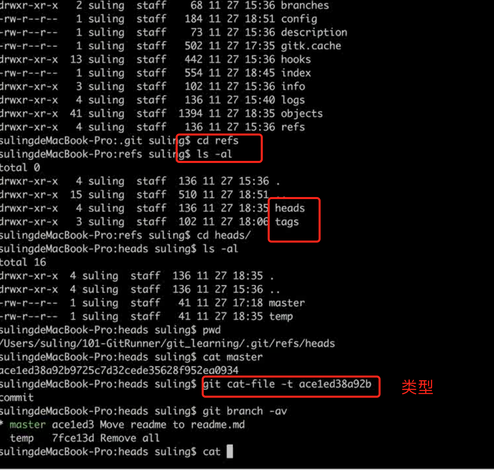

### 1. HEAD文件


### 2. config文件


### 3.ref目录存放各个分支的指针指向的commit


### 4.objects
存放的是树（tree）和文件(blob)


```
drwxr-xr-x 1 Andy 197609   0 12月 17 22:38 ./
drwxr-xr-x 1 Andy 197609   0 12月 17 21:50 ../
-rw-r--r-- 1 Andy 197609   7 12月 17 22:38 COMMIT_EDITMSG
-rw-r--r-- 1 Andy 197609 301 12月 12 22:55 config
-rw-r--r-- 1 Andy 197609  73 12月 12 22:55 description
-rw-r--r-- 1 Andy 197609  96 12月 19 00:00 FETCH_HEAD
-rw-r--r-- 1 Andy 197609  23 12月 12 22:55 HEAD
drwxr-xr-x 1 Andy 197609   0 12月 12 22:55 hooks/
-rw-r--r-- 1 Andy 197609 249 12月 17 22:38 index
drwxr-xr-x 1 Andy 197609   0 12月 12 22:55 info/
drwxr-xr-x 1 Andy 197609   0 12月 12 22:55 logs/
drwxr-xr-x 1 Andy 197609   0 12月 17 22:38 objects/
-rw-r--r-- 1 Andy 197609 114 12月 12 22:55 packed-refs
drwxr-xr-x 1 Andy 197609   0 12月 12 22:55 refs/
```
相关命令
```
cat命令主要用来查看文件内容，创建文件，文件合并，追加文件内容等功能。
cat HEAD 查看HEAD文件的内容
git cat-file 命令 显示版本库对象的内容、类型及大小信息。
git cat-file -t b44dd71d62a5a8ed3 显示版本库对象的类型
git cat-file -s b44dd71d62a5a8ed3 显示版本库对象的大小
git cat-file -p b44dd71d62a5a8ed3 显示版本库对象的内容
```

.git里几个常用的如下：
```
HEAD：指向当前的工作路径
config：存放本地仓库（local）相关的配置信息。
refs/heads: 存放分支
refs/heads/master/: 指向master分支最后一次commit
refs/tags: 存放tag，又叫里程牌 （当这次commit是具有里程碑意义的 比如项目1.0的时候 就可以打tag）
objects：核心文件，存储文件
```
.git/objects/ 存放所有的 git 对象，对象哈希值前 2 位作为文件夹名称，后 38 位作为对象文件名, 可通过 git cat-file -p 命令，拼接文件夹名称+文件名查看。
