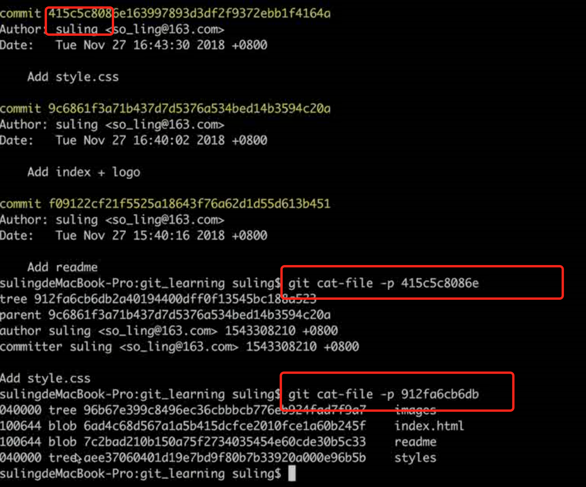
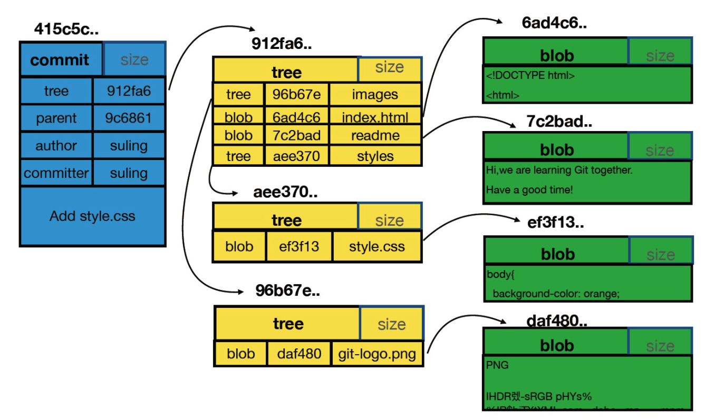

每一个commit都可能包含以下的一些信息：


```
commit: 提交时的镜像
tree: 文件夹
blob: 文件
```

```
【同学问题】 每次commit，git 都会将当前项目的所有文件夹及文件快照保存到objects目录，如果项目文件比较大，不断迭代，commit无数次后，objects目录中文件大小是不是会变得无限大？
【老师解答】 Git对于内容相同的文件只会存一个blob，不同的commit的区别是commit、tree和有差异的blob，多数未变更的文件对应的blob都是相同的，这么设计对于版本管理系统来说可以省很多存储空间。其次，Git还有增量存储的机制，我估计是对于差异很小的blob设计的吧。
```
