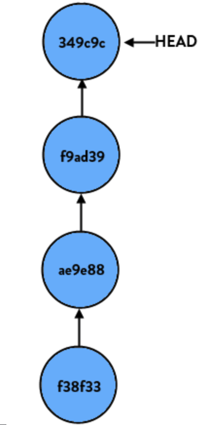
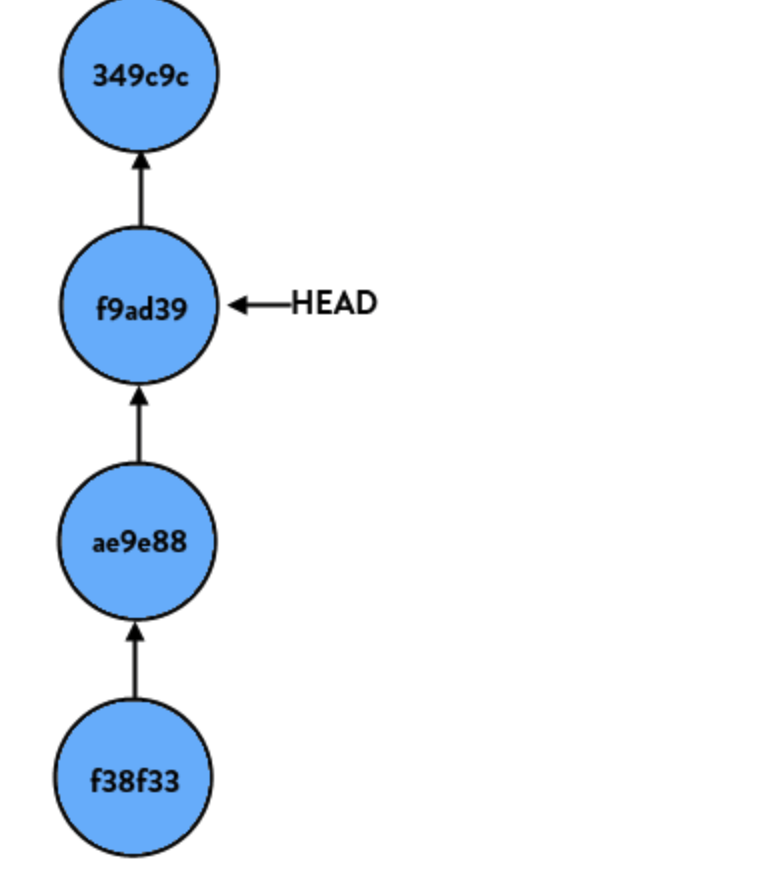
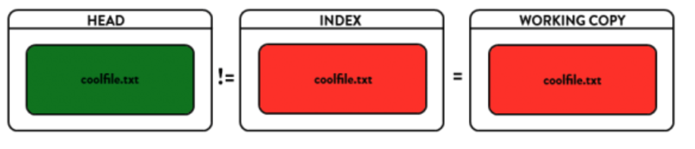
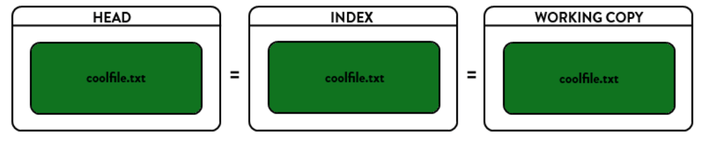
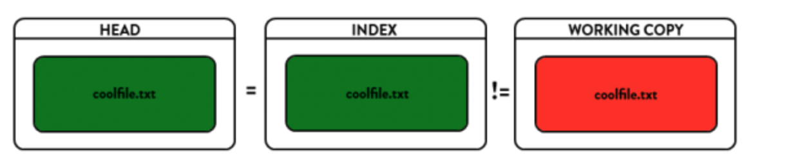

### 1. 理解git reset

首先明白三个区域的概念：
HEAD : 这是当前分支版本顶端的别名，也就是在当前分支你最近的一个提交
Index(暂存区)：index也被称为staging area，是指一整套即将被下一个提交的文件集合。
working copy(工作区) ： 代表你正在工作的那个文件目录

当你第一次checkout一个分支，HEAD就指向当前分支的最近一个commit。在HEAD中的文件集（实际上他们从技术上不是文件，他们是blobs（一团），但是为了讨论的方便我们就简化认为他们就是一些文件）和在index中的文件集是相同的，在working copy的文件集和HEAD,INDEX中的文件集是完全相同的。所有三者(HEAD,INDEX(STAGING),WORKING COPY)都是相同的状态，GIT很happy。

当你对一个文件执行一次修改，Git感知到了这个修改，并且说：“嘿，文件已经变更了！你的working copy不再和index,head相同！”，随后GIT标记这个文件是修改过的。

然后，当你执行一个git add,它就stages the file in the index，并且GIT说：“嘿，OK，现在你的working copy和index区是相同的，但是他们和HEAD区是不同的！”

当你执行一个git commit,GIT就创建一个新的commit，随后HEAD就指向这个新的commit，而index,working copy的状态和HEAD就又完全匹配相同了，GIT又一次HAPPY了。

下面这一段是另外一个牛人的解释：
总的来说，git reset命令是用来将当前branch重置到另外一个commit的，而这个动作可能会将index以及work tree同样影响。比如如果你的master branch（当前checked out）是下面这个样子:
```
- C (HEAD, master)
- B
- A
```
HEAD和master branch tip是在一起的，而你希望将master指向到B，而不是C，那么你执行git reset B 以便移动master branch到B那个commit：
```
- B (HEAD, master) # - C is still here, but there's no branch pointing to it anymore
- A
```
**注意：git reset和checkout是不一样的。如果你运行git checkout B,那么你讲得到,一般不会git checout到某一个commit**：
```
- C (master)
- B (HEAD)
- A
```
这时HEAD和master branch就不在一个点上了，你进入detached HEAD STATE. HEAD,work tree,index都指向了B，但是master branch却依然指向C。如果在这个点上，你执行一个新的commit D，那么你讲得到下面（当然这可能并不是你想要的，你可能想要的是创一个branch做bug fix）:
```
- A - B - A (master)
       \
        D (HEAD)
```
记住git reset不会产生commits,它仅仅更新一个branch（branch本身就是一个指向一个commit的指针）指向另外一个commit(Head和branch Tip同时移动保持一致).其他的仅剩对于index和work tree(working directory)有什么影响。git checkout xxxCommit则只影响HEAD，如果xxxCommit和一个branch tip是一致的话，则HEAD和branch相匹配，如果xxxCommit并不和任何branch tip相一致，则git进入detached HEAD 状态

### 2. reset
如果你仔细研究reset命令本身就知道，它本身做的事情就是重置HEAD(当前分支的版本顶端）到另外一个commit。假设我们有一个分支（名称本身无所谓，所以我们就简单称为"super-duper-feature”分支吧），图形化表示如下：



```
git reset HEAD

```
任何事情都不会发生，这是因为我们告诉GIT重置这个分支到HEAD，而这个正是它现在所在的位置。
```
git reset HEAD~1

```
当我们再执行上面的命令时（HEAD~1是the commit right before HEAD的别名，或者说：put differently "HEAD's parent"），我们的分支将会如下所示:


如果我们执行git reset HEAD~2,则意味着将HEAD从顶端的commit往下移动两个更早的commit。

### 3.git reset --soft
```
git reset --soft commit-ID

```
--soft参数告诉Git重置HEAD到另外一个commit，但也到此为止。如果你指定--soft参数，Git将停止在那里而什么也不会根本变化。这意味着index, working copy都不会做任何变化，所有的在original HEAD和你重置到的那个commit之间的所有变更集都放在stage(index)区域中。



### 4.git reset --hard
```
git reset --hard commitid
```
--hard参数将会blow out everything.它将重置HEAD返回到另外一个commit(取决于~12的参数），重置index以便反映HEAD的变化，并且重置working copy也使得其完全匹配起来。这是一个比较危险的动作，具有破坏性，数据因此可能会丢失！如果真是发生了数据丢失又希望找回来，那么只有使用：git reflog命令了。makes everything match the commit you have reset to.你的所有本地修改将丢失。如果我们希望彻底丢掉本地修改但是又不希望更改branch所指向的commit，则执行git reset --hard = git reset --hard HEAD. i.e. don't change the branch but get rid of all local changes.另外一个场景是简单地移动branch从一个到另一个commit而保持index/work区域同步。这将确实令你丢失你的工作，因为它将修改你的work tree！



### 5. git reset
```
git reset commit-ID
# or
git reset --mixed commit-ID
```
--mixed是reset的默认参数，也就是当你不指定任何参数时的参数。它将重置HEAD到另外一个commit,并且重置index以便和HEAD相匹配，但是也到此为止。working copy不会被更改。所有该branch上从original HEAD（commit）到你重置到的那个commit之间的所有变更将作为local modifications保存在working area中，（被标示为local modification or untracked via git status)，但是并未staged的状态，你可以重新检视然后再做修改和commit.


### 6. 撤销git reset --hard
```
# step 1 查看git reset --hard之前的删除的log
git reflog

# step 2 恢复
git reset –hard commit-ID

# or
git cherry-pick commit-ID
```
