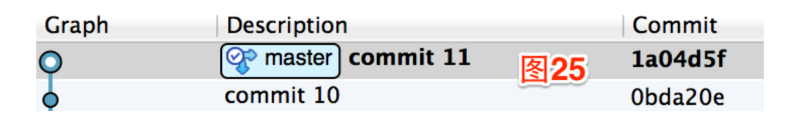
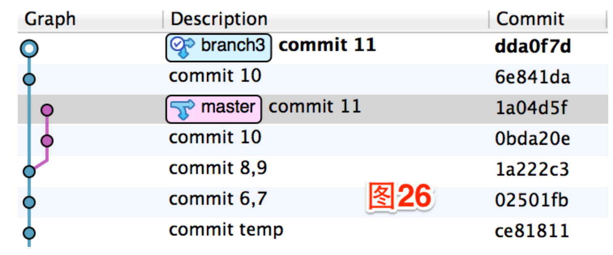
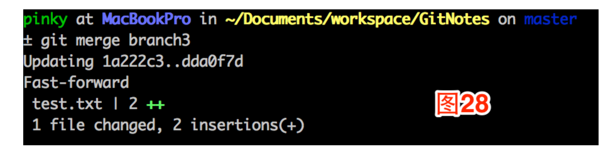
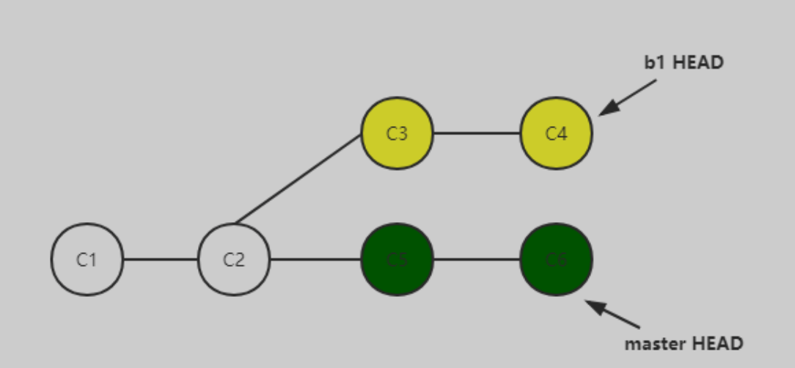
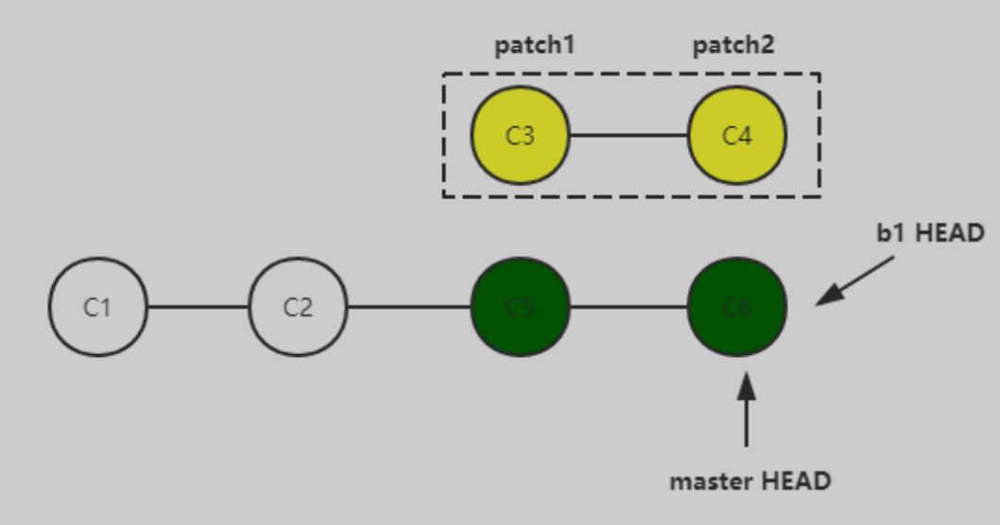
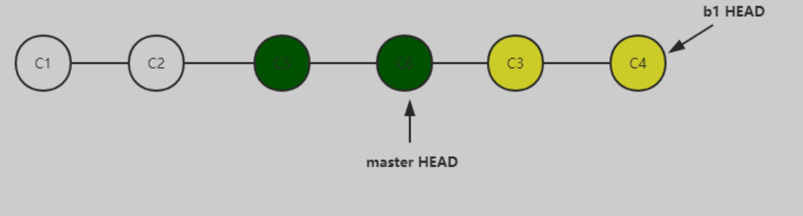
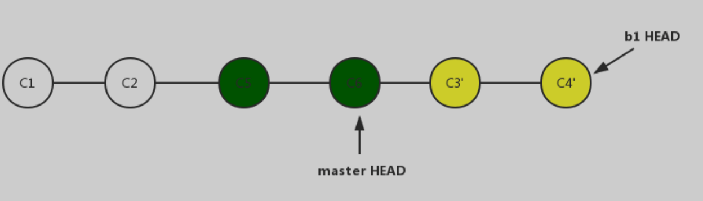

### 1. cherry-pick
cherry-pick其实在工作中还挺常用的，一种常见的场景就是，比如我在A分支做了几次commit以后，发现其实我并不应该在A分支上工作，应该在B分支上工作，这时就需要将这些commit从A分支复制到B分支去了，这时候就需要cherry-pick命令了.

**假设：**
在master分支上做两次提交，第一次添加一行”test 10”，git commit -am "commit 10"，第二次添加“test 11”，到达如下图的状态：

这个时候我们发现，哦NO，我们不应该直接更改master分支，我们应该在自己的分支上做提交。这个时候先新建一个分支git checkout -b branch3 1a222c3。现在我们需要把刚才的两次提交移动到新的分支上。运行git cherry-pick 0bda20e 1a04d5f，命令行会给出提示两个commit被复制到了当前分支上，此时SourceTree的状态如下图：

确定这两个commit被复制到指定分支以后，在master分支上将这两个commit删除。先切回master分支：git checkout master，运行git reset --hard 1a222c3。

### 2.merge命令
要将master分支当前最新的commit合并到branch3上，因为你的branch3的起点此时可能已经不是master分支的最新commit了。切换到branch3分支上运行git merge master，Git提示“Already up-to-date.”，这说明当前所在的分支branch3比master分支还要新，branch3上的commit都是master最新commit点的子commit，故不需要合并。切回master分支git checkout master，将分支branch3合并到master分支上，git merge branch3，结果如下图：

### 3.rebase
先看git rebase。现在有一个master分支，在进行了2次提交后（C1、C2），checkout出来一个b1分支。在b1分支中进行了2次commit（C3，C4），与此同时master分支也进行了2次commit（C5，C6）。现在的提交记录如下图：

当我们在b1分支上执行git rebase master后，git会将C3、C4暂时删除，并将b1的HEAD指向master分支的HEAD，如下图：

然后将C3、C4以应用patch的方式放在C6之后，同时将b1 HEAD重新指向C4。对master分支没有影响。应用patch的过程可以简单理解为类似merge的操作，是将C3、C4的代码改动merge到新的dev分支上（所以，git rebase是可能发生冲突的）。

用git log查看C3和C4的commit id，会发现C3、C4已经不是原来的id了，这里的C3、C4只是原来的一个copy。

所以更为准确的结果表示是：

总结来说，该命令的效果是将自从b1和master分叉后的、master分支上新的commit放到b1的commit之前。

说的更通俗易懂些，就是将b1分支从原来的分叉点整个拔掉，放到了master分支的HEAD处，就像它重新从master HEAD处长出来一样。
