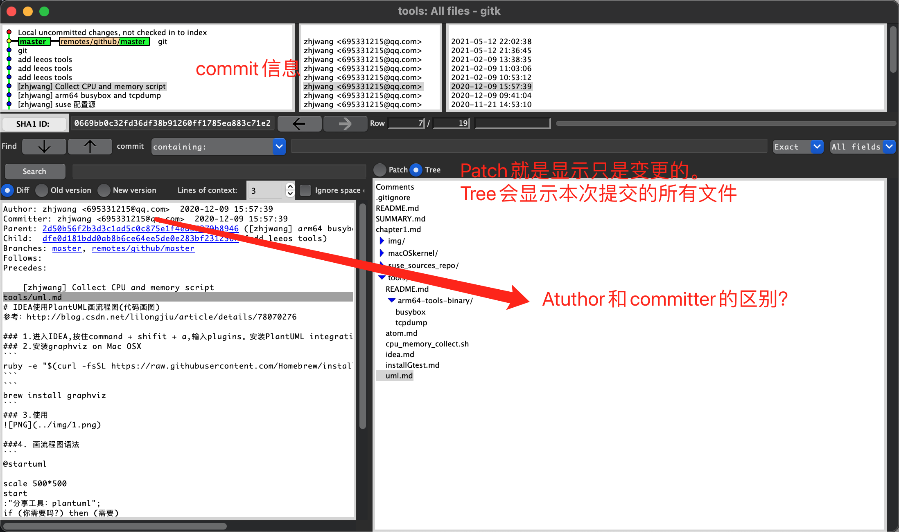

author和committer的区别：
举例： 比如master上的一个commiter我想把它加入到tmp这个分支上，这个叫做cherry-pick（挑选某一个commiter放入到另外一个分支上），git是非常在乎版权的，比如你从master挑选的某个commiter是张三，挑选到tmp分支上之后，commiter就是你，但是author是张三。

**Branches的意思：**是哪几个分支上都包含这个commiter
