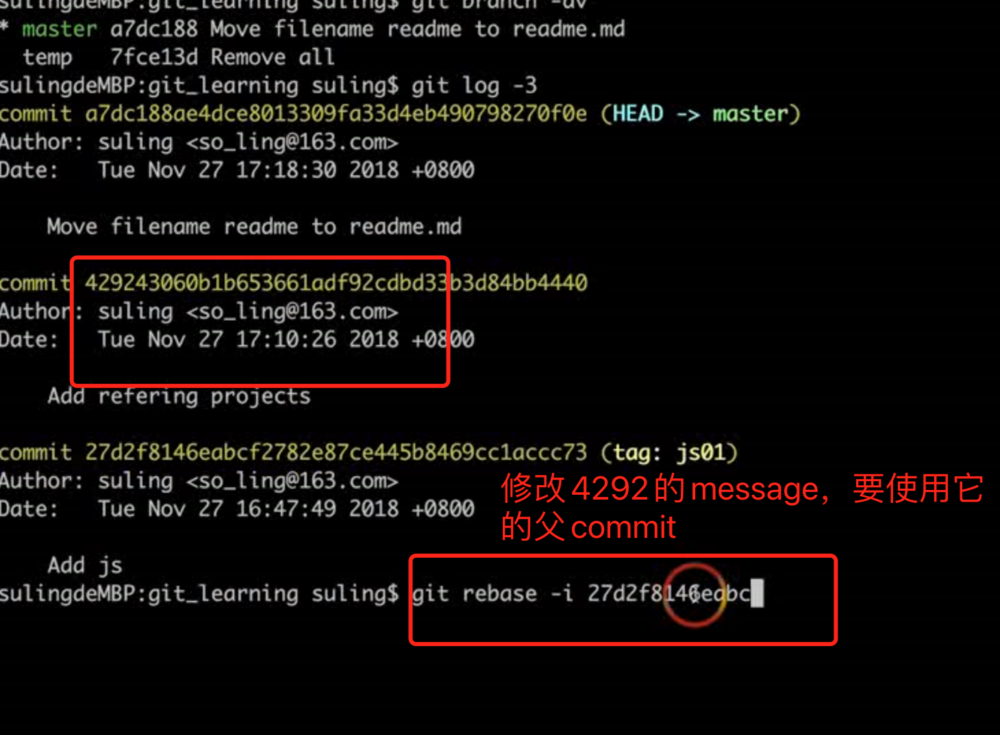
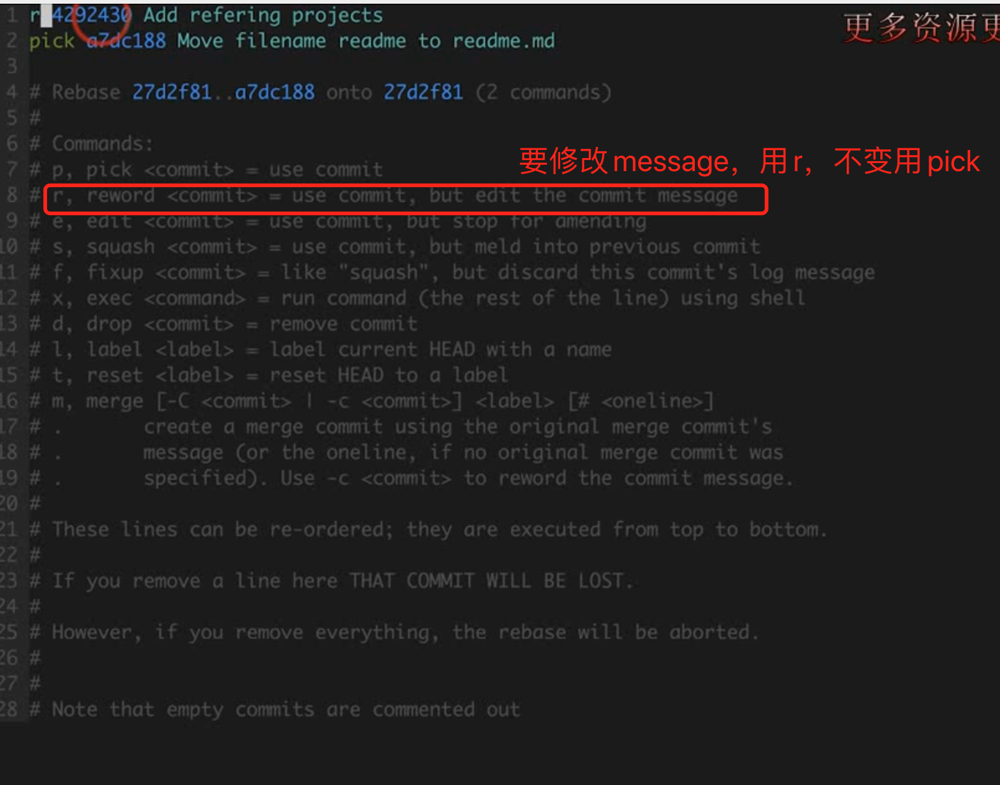
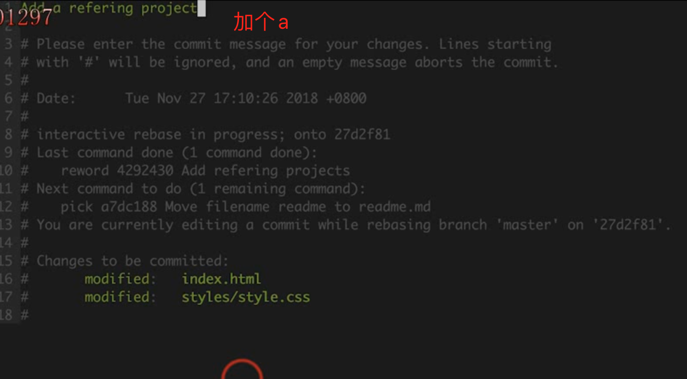

**注意，这中变更方式，只是对于我们本地的commit改变，还没有提交到远端的commit message.**

git rebase -i commitid(变基)









```
git rebase工作的过程中，就是用了分离头指针。rebase意味着基于新base的commit来变更部分commits。它处理的时候，把HEAD指向base的commit，此时如果该commit没有对应branch，就处于分离头指针的状态，然后重新一个一个生成新的commit，当rebase创建完最后一个commit后，结束分离头状态，Git让变完基的分支名指向HEAD。
```
