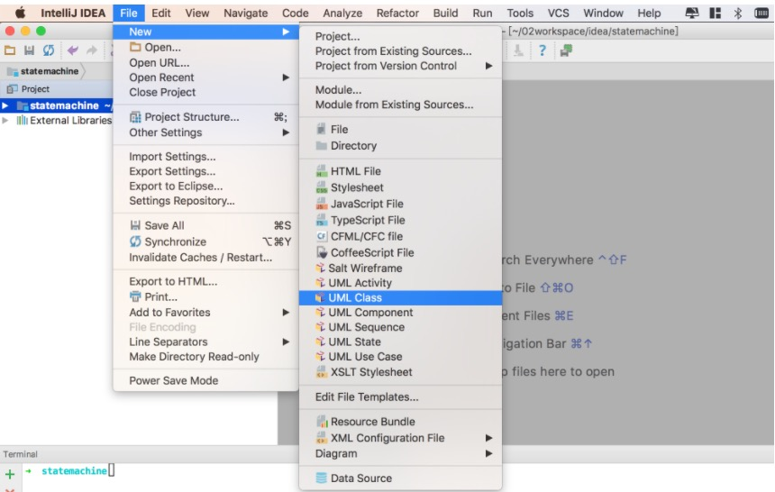

# IDEA使用PlantUML画流程图(代码画图)
参考：http://blog.csdn.net/lilongjiu/article/details/78070276

### 1.进入IDEA,按住command + shifit + a,输入plugins。安装PlantUML integration。
### 2.安装graphviz on Mac OSX
```
ruby -e "$(curl -fsSL https://raw.githubusercontent.com/Homebrew/install/master/install)" < /dev/null 2> /dev/null
```
```
brew install graphviz
```
### 3.使用


###4. 画流程图语法
```
@startuml

scale 500*500
start
:"分享工具：plantuml";
if (你需要吗?) then (需要)
    :"花1个小时";
    :"有帮助";
    stop
else (不需要)
    :"有visio就够了";
    stop
endif

caption figure 1.2 test

@enduml
```

