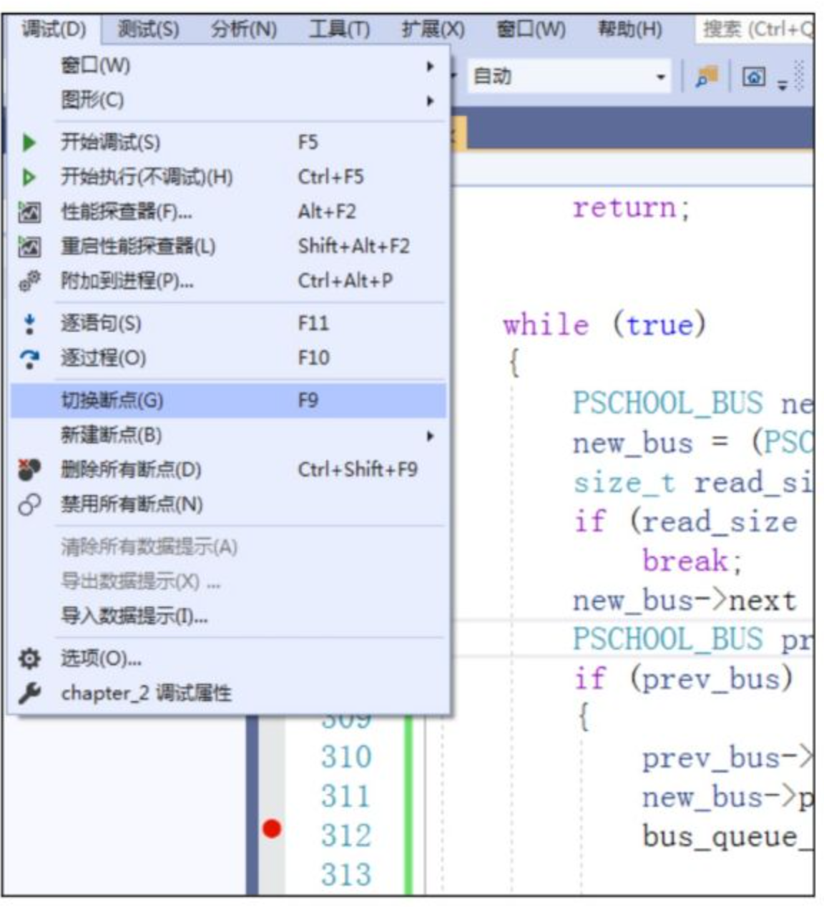
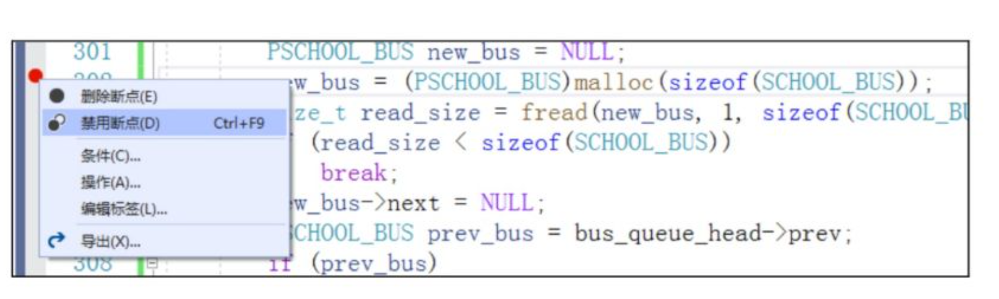
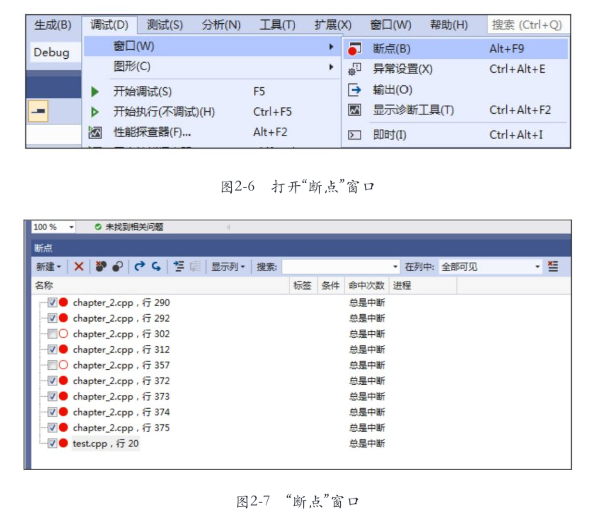
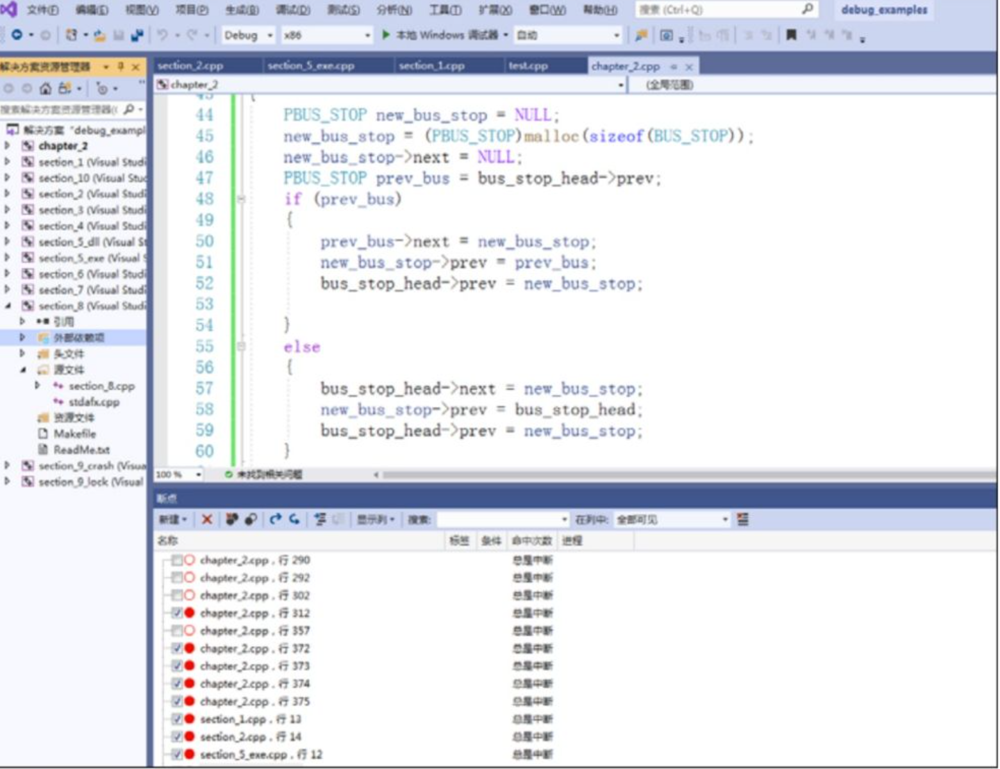
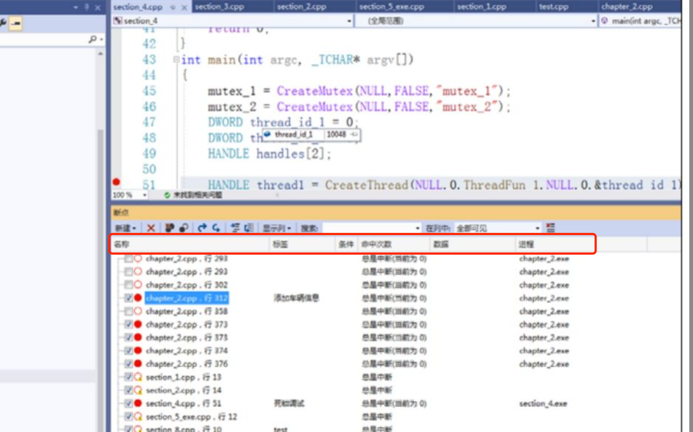

### 1.设置和管理断点
快捷键F9,快速打断点和消除断点。

### 2.禁用断点
有时候需要临时禁用一个断点，而不是删除一个断点。

### 3.查看所有断点

在断点窗口中，可以很方便的对断点进行管理。比如删除某些断点、禁用/启用某些断点。需要说明的是，“断点”窗口中显示的是当前解决方案中所有项目中的断点信息，而**不是某一个项目**的断点信息。比如，如果当前打开的解决方案中包含10个项目，那么10个项目中的所有的断点都会显示出来。

一个断点的属性有很多，比如名称、标签、条件、进程等。
* 名称就是源文件的文件名，后面是断点所在该文件的代码行号。
* 标签是对断点的有意义描述（比如说这个断点的用途），可以用来区分其他的断点。尤其是同一个文件中有多个断点时，我们通过“断点”窗口很难直接看出各个断点的作用，如果给断点打一个标签，取一个有意义的名字，就会一目了然。
* 条件属性是断点执行的条件，命中次数指的是在调试过程中，这个断点命中了多少次。
* 进程指的是当前断点属于哪一个进程，只有在调试状态下才会显示。该功能非常有用，尤其是解决方案中有多个项目的时候，如果两个项目中的文件名都相同，在没有进程属性的情况下则无法判断断点属于哪一个进程。我们来看一个调试状态下的“断点”窗口效果，如下图所示。

对于白色小圆圈外加一个惊叹号。这说明该断点不是启用状态，也不是禁用状态。
这种图标表示该断点不会被命中，因为源代码所对应的**调试符号没有加载**。
符号在两种情况下不会被加载，一种是该断点对应的程序不处于调试状态，比如上图标签为test的断点，它对应的程序是section_8.exe，但是section_8.exe并没有被调试，所以显示该图标；另外一种情况是虽然断点对应的程序已经启动，而且处于调试状态，但是由于各种原因（比如版本不匹配）没有办法成功加载，也会显示该图标。
