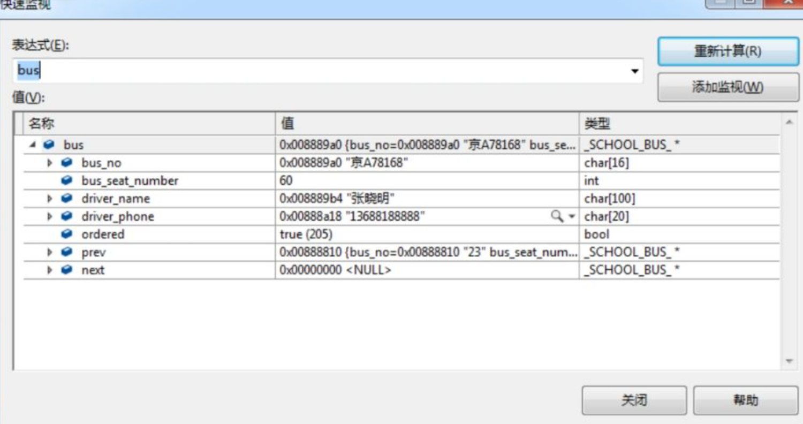
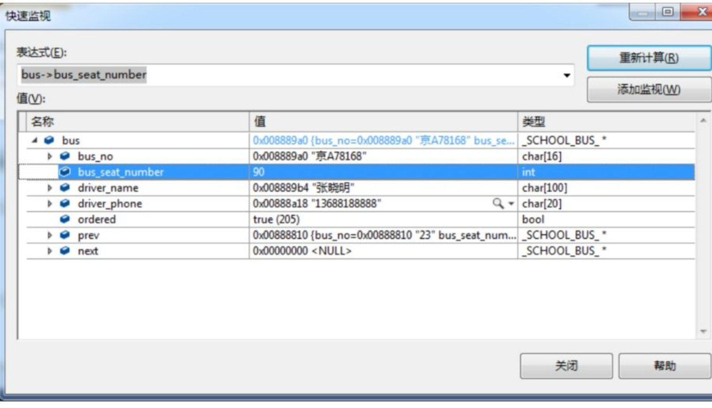
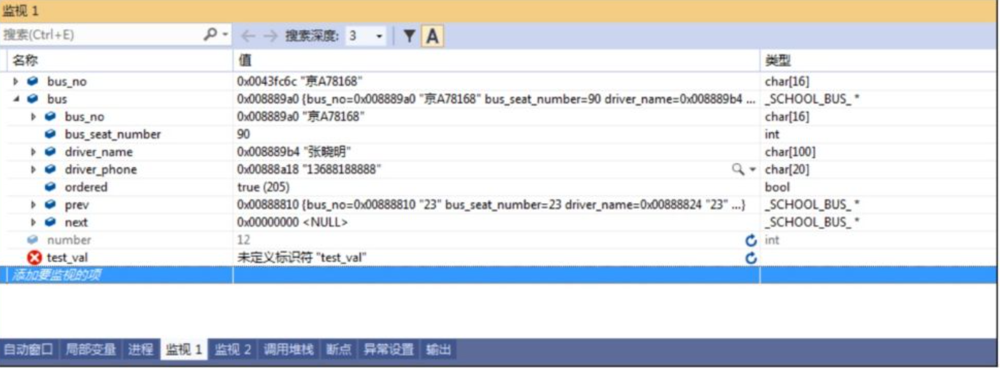
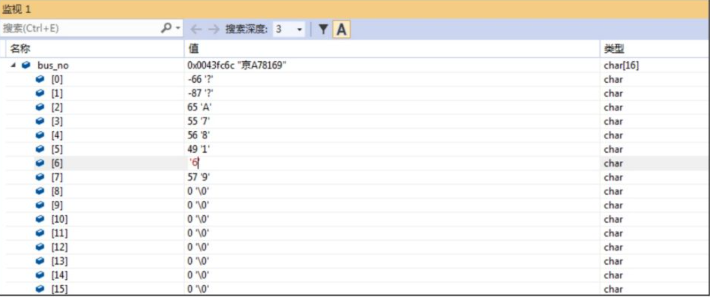
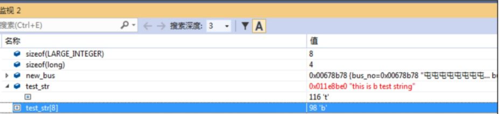
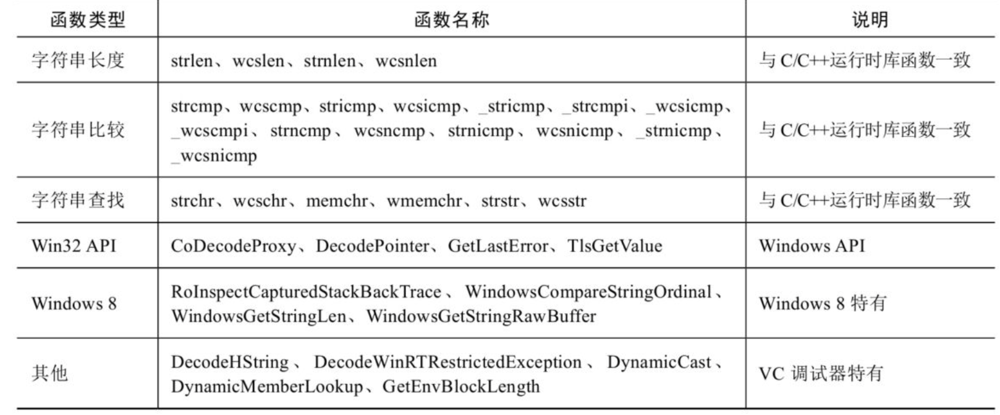
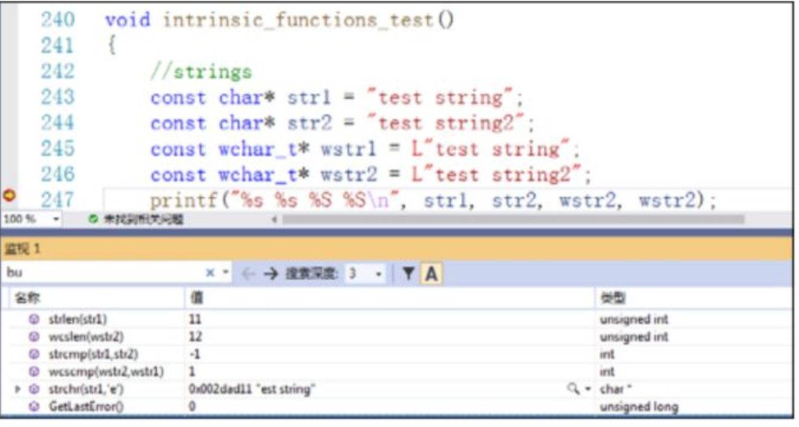

### 1.快速监视
将鼠标放在要监视的变量上，右键鼠标，然后选择“快速监视”（Shift+F9组合键），就会弹出“快速监视”窗口，同时会把该变量当前值的信息显示出来，如下图所示：

同时还可以修改变量的值，也可以修改结构体对象的某个字段或者类对象的某些成员变量等。比如我们要修改下图中的bus变量bus_seat_number字段的值，只需要用鼠标双击它进入修改状态，即可进行修改。我们可以按下Enter键来保存对这个字段的修改，也可以通过将鼠标焦点移动到其他字段来保存修改。完成修改后，“快速监视”窗口对变量的显示会有一个变化，提示该变量已经修改，在变量对应的行（即第一行）会用不同的颜色来显示，如图2-15所示。

### 2.监视窗口
监视（Watch）窗口是“快速监视”窗口的升级版本，没有“快速监视”窗口的局限性，在调试状态下，可以通过“调试”菜单的“窗口”命令来打开“监视”窗口。“监视”窗口中可以同时显示或者修改多个变量，而且可以同时打开多个“监视”窗口。如果在调试过程中想要监视的变量非常多，则“监视”窗口会非常有帮助。比如在同时调试多个程序的情况下，可以针对每一个程序使用一个“监视”窗口，避免因为一个“监视”窗口中变量太多而引起混淆。

可以通过拖动的方式将希望监视的变量添加到“监视”窗口中，也可以在变量上单击鼠标右键，然后选择“添加监视”命令添加要监视的项。

其中“监视1”窗口中共监视了4个变量：bus_no、bus、test_val以及number。test_val是一个无效的变量，所以它的值显示为“未定义标识符”。而number是在该调试上下文中无效的一个变量，即number不是一个全局变量，也不是在该函数内可以访问的变量，所以它显示为被禁用的状态（number其实是另外一个函数中的一个临时变量，是在调试那个函数的时候被添加到“监视1”窗口中的）。

**修改监视的变量的值：**
如果变量是简单数据类型，比如数字型、bool型等，修改起来是比较方便的，可以直接修改。字符数组修改起来则稍微麻烦一些，需要定位到具体的某个位置，修改对应的某个字符，而不能像整型、bool型等变量可以直接修改整个变量。比如我们想修改图2-16中的bus_no变量，由于bus_no是一个字符串类型，当前值为“京A78169”，如果想将其修改成“京A78179”，则需要定位到bus_no[6]，然后将其修改为“7”，如图2-17所示。如果希望修改中文字符，则更麻烦一些，需要知道中文字符对应的ASCII编码，而且一个中文字符对应两个ASCII字符。

对于标准库的字符串（比如std::string类型），仍然可以通过这种方式进行修改，这是VC2019的增强功能。早期的VC版本不能修改标准库的std::string类型变量，甚至连监视和查看字符串内容都不容易实现。

即使一个变量被声明为const，仍然可以在“监视”窗口中进行修改。还可以在“监视”窗口中计算表达式的值，使用四则运算来进行一些简单的计算；也可以使用C/C++的一些关键字，比如查看某个数据类型的大小、计算系统结构体的大小等。

如果变量是一个指针（比如字符串指针），修改起来不是特别直观。例如，将字符串变量const char* test_str = "this is a test string"添加到“监视”窗口中，可以发现“监视”窗口中只显示了第一个字符，其余的字符并没有显示出来。如果要想修改字符串中的某个字符，则只能将指针变量对应位置的值添加到“监视”窗口中。比如要把a修改成b，就需要将test_str[8]添加到“监视”窗口中，然后进行修改，如图2-18所示。

### 3.表达式的支持
处于调试状态时，可以在“监视”窗口或者“快速监视”窗口中输入表达式，并且可以计算表达式的值。
在使用表达式时，可以使用调试器内在支持的一些函数（也称为内嵌函数），这些函数与Windows API或者C/C++运行时库中的函数名称和功能都是相同的，分别为字符串长度函数、字符串比较函数、字符串查找搜索函数、Win32 API等，如表2-3所示。

下面通过几个简单的例子来了解如何在“监视”窗口中调用这些内嵌的函数，如图2-19所示。

在图2-19中，“监视”窗口中调用了字符串相关的strlen、wcslen、strcmp、strchr和Win32 API GetLastError，都成功地返回了结果。
