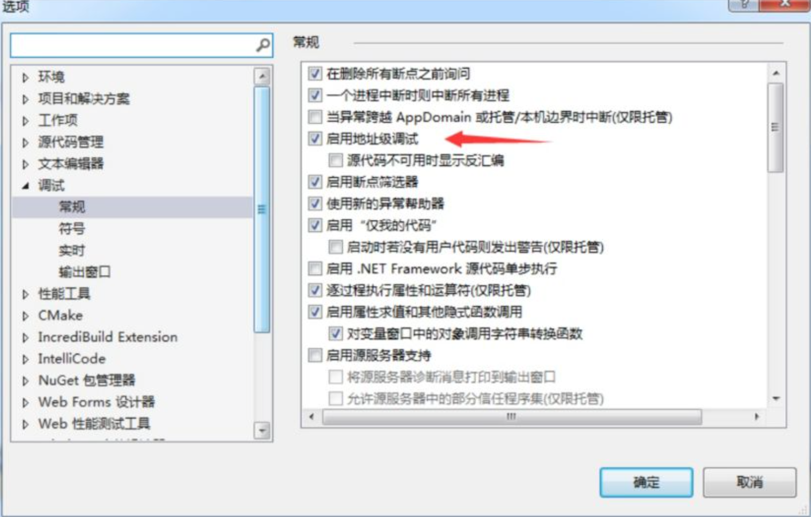
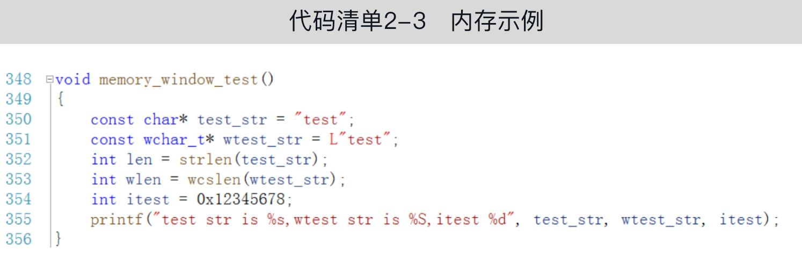
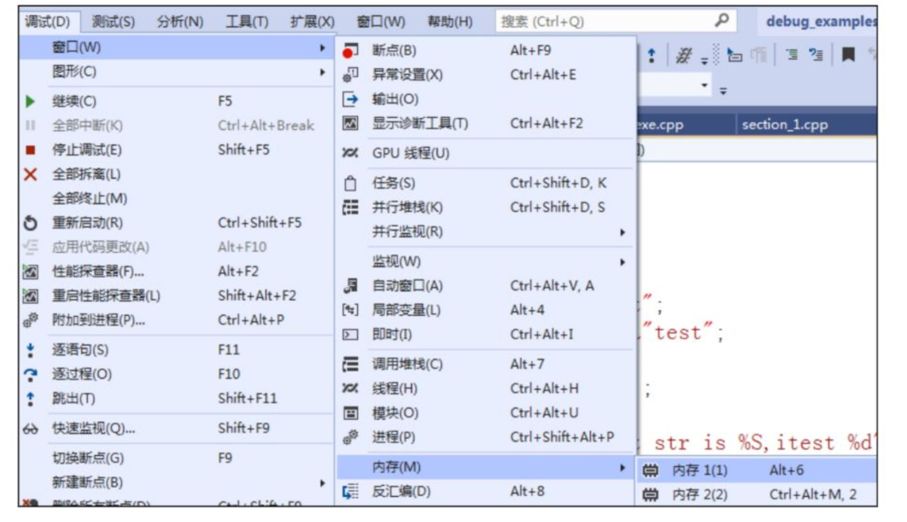
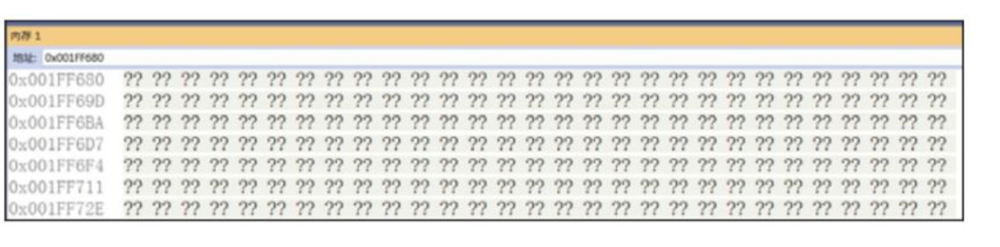
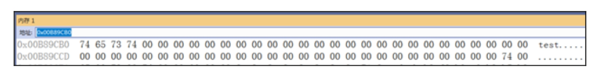
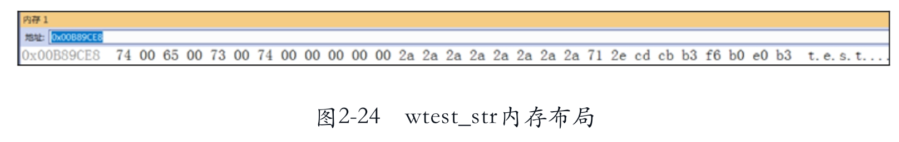

上一节介绍了查看变量、修改变量的方法，使用起来非常方便。但如果变量类型是字符串指针，修改起来就不会那么方便，因为我们并不了解该变量在内存中的布局、存储方式、空间分布等。这些问题都可以通过“内存”窗口来解决。通过这一节的学习，我们可以对内存有更深刻的认识。

## 内存查看
内存（Memory）窗口在调试中也是非常重要的，可以通过“调试”→“窗口”中的“内存”命令来打开内存窗口。除此之外，“调试”设置中的“启用地址级调试”必须是打开的，如图2-20所示。默认情况下该选项是启用的，如果在调试过程中发现不能使用“内存”窗口，可以通过“工具”菜单下的“选项”命令进行设置。

### 字符串内存布局

调试程序，执行至355行时暂停，通过“调试”菜单或者Alt+6组合键打开“内存”窗口，如图2-21所示。

打开“内存”窗口之后，“内存”窗口中默认没有什么内容，只有一些随机的值或者0，如图2-22所示。

在函数memory_windows_test中，函数的第一行（也就是代码的第350行）定义了一个字符串，值为“test”。第351行也定义了一个字符串，值为“test”，只有这个变量是宽字符，即UNICODE字符。第352和353行分别计算两个字符串的长度。第354行定义了一个整型变量并赋值为0x12345678。最后一行把它们显示出来。

这个代码很简单，两个字符串的长度相同，都为4，我们观察一下它们在内存中的存储方式。先来看test_str在内存中的布局，可以把test_str直接拖曳至“内存”窗口的地址栏中，地址栏会自动显示它的内存布局；也可以在内存窗口的地址栏中直接输入test_str，然后按Enter键，效果如图2-23所示。

从图2-23中可以看到，test_str的起始地址为0x00B89CB0，一共占用了5字节，因为有一个结束符也需要占用空间，它们对应的值分别为74 65 73 74 00。这很好理解，一个字符对应一个字节的内存。再来看wtest_str的内存布局，如图2-24所示。

从图2-24可以看到，wtest_str的内存布局与test_str的内存布局完全不同，wtest_str在内存中对应的值分别为7400 6500 7300 7400 0000，所占用的空间比test_str多了一倍。因为wtest_str是宽字符（UNICODE编码），每一个字符要占用2字节，即使是英文字符，也要占用2字节。UTF-8编码则有些不同，内存中的布局也会不同，如果使用UTF-8来编码汉字字符，一个汉字字符要占用3字节，但是英文字符则只占用1字节。

### 整型变量内存
整型变量的内存布局涉及字节序（即字节的顺序）的问题，比如有一种数据类型占用2字节，那么是高位字节在前面还是低位字节在前面？如果一个类型只占用1字节，则不用关心字节序的问题。

在本测试代码中，itest变量是int型，所以占用4字节，它的值为0x12345678，分成4字节即0x12、0x34、0x56、0x78，但是在内存中，这4字节是按照从低到高的顺序排列呢，还是按照从高到低的顺序排列呢？

在计算机世界中，主要有两种CPU架构：PowerPC、X86系列。它们存储数据的方式是不同的，PowerPC采用的是大端存储方式，X86采用的是小端存储方式。大端是指把字节序的尾端放在高内存地址，而小端是指把字节序的尾端放在低内存地址。以itest=0x12345678为例，如果是大端存储，因为字节序的尾端是0x78，所以0x78在高内存地址，0x12在低内存地址，最终的存储是0x12345678（假设内存地址从左到右递增）。小端存储则完全相反，最终的存储是0x78563412。作者的CPU是X86系列，因此是小端存储，在内存中应该是0x78563412。来实际验证一下。将itest添加到内存窗口中，可以在内存窗口的地址栏中直接输入&itest，然后按Enter键，结果如图2-25所示。

