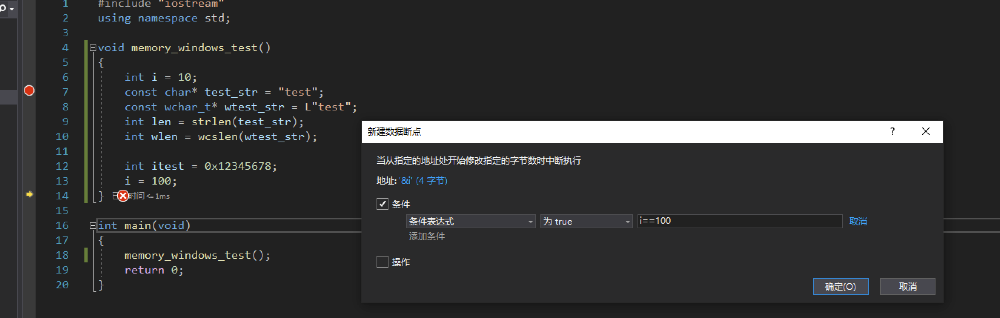

## 内存断点
用于查看内存在什么地方被改变的。Vs的路径：调试】->【新建断点】->【新建数据断点(D)…】

例如：
```
#include "iostream"
using namespace std;

void memory_windows_test()
{
	int i = 10;
	const char* test_str = "test";
	const wchar_t* wtest_str = L"test";
	int len = strlen(test_str);
	int wlen = wcslen(wtest_str);

	int itest = 0x12345678;
	i = 100;
}

int main(void)
{
	memory_windows_test();
	return 0; 
}
```

我们想要看i在什么地方被改变的。就像下面这样打断点，在i==100的时候，就会被断下来。


在程序比较大的时候，一个变量在被很多地方改变的时候，可以快速的定位到是哪里改变了这个值。
